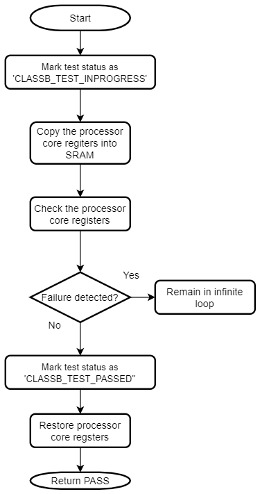

# MPLAB® Harmony Class B Library for PIC32MZ W1 devices

The Class B Library provides APIs to perform self-tests for the on-board systems of the microcontroller.

**Features Tested by the Class B Library**

Following table shows the components tested by the Class B library.

|Component|Reference \(Table H1 of IEC 60730-1\)|Fault/Error|Acceptable Measures|
|---------|-------------------------------------|-----------|-------------------|
|CPU Registers|1.1|Stuck-at|Static memory test|
|CPU Program Counter|1.3|Stuck-at|Static memory test|
|Interrupts|2|No interrupt / too frequent interrupt|Functional test|
|CPU Clock|3|Wrong frequency|Frequency monitoring|
|Flash|4.1|All single bit faults|Modified checksum|
|SRAM|4.2|DC fault|Static memory test|
|SRAM data path|5.1|Stuck-at|Static memory test|
|SRAM data path|5.2|Wrong address|Static memory test|
|Digital I/O|7.1|Abnormal operation|Input comparison or output verification|

**Class B Peripheral Library Usage**

This topic describes the basic architecture of the Class B library and provides information and examples on how to use it. APIs defined by the Class B library can be used either by the start-up code or by the application code. The application may use PLIBs, drivers or middleware from the Harmony 3 software framework along with the Class B library code.

Abstraction Model

The following picture shows positioning of Class B library in a Harmony 3 based application.

**Start-up vs. Run-time**

The Class B library contains many self-test routines those can be executed at startup and run-time. If a self-test is executed at startup, it is called as a Start-up Self-test \(SST\) and if it is executed at run-time, then it is called a Run-time Self-test \(RST\). There are a few self-tests which can be used only as SST or as RST, such self-tests have SST or RST in the API name eg: `CLASSB_RST_IOTest()`, `CLASSB_SST_InterruptTest()`. If a self-test API does not have SST or RST in its name, then it can be used at startup as well as runtime.

**Start-up Self-test \(SST\)**

SSTs are used to test a component inside the microcontroller before it is initialized and used. When the Class B library is added via MCC, the selected SSTs are inserted into the `_on_bootstrap()` function which is called during start-up, before main. This means that none of the data initialization could have happened before running SSTs. So, the Class B library initializes necessary variables before using them. It is not mandatory to test all the components during startup. The SRAM can be tested partially if a faster startup is needed by the application. In this case, modify the corresponding configuration macro \(`CLASSB_SRAM_STARTUP_TEST_SIZE`\) present in `classb.h` file to change the size of the tested area.

**Run-time Self-test \(RST\)**

RSTs can be used by the application during run-time to check safe operation of different components in the microcontroller. These tests are non-destructive. In the case of run-time tests, the application shall decide which test to execute when.

**Components in the Library**

The Class B library contains self-test routines for different components inside the CPU.

**Critical and Non-critical Components**

Based on the impact of failure, different components inside this Class B library are categorized as critical or non-critical.

If the self-test for CPU registers, PC or Flash detects a failure, the code execution is stopped, and it remains in an infinite loop. This is to prevent unsafe code execution. In the case of non-critical components, a failsafe function \(`CLASSB_SelfTest_FailSafe`\) is called when a failure is detected. This function contains a software break point and an infinite loop. Further code shall be added into this function as per the application need. The failsafe function must not return to the Class B library, since it is called due to a self-test failure. Avoid use of features which depend on the failed component. For example, if self-test for clock is failed, it is not advisable to use UART for error reporting as BAUD rate may not be accurate. In the case of SRAM failure, avoid the use of function calls or use of variables in SRAM. A simple error reporting mechanism in this case of SRAM failure can be toggling of an IO pin.

**Critical Components**

1.  CPU registers including the Program Counter

2.  Internal Flash program memory

Generic Flow of Critical Tests

**Non-critical Components**

1.  CPU clock

2.  IO pins

3.  Internal SRAM

4.  Interrupts

Generic Flow of Non-Critical Tests

**Self-tests for Components in the Library**

**CPU Registers**

The MIPS32® M-Class Microprocessor Core is the CPU on the PIC32MZW1 devices. The Class B library checks the processor core registers for stuck-at faults. The stuck-at condition causes register bit to remain at logic 0 or logic 1. Code execution should be stopped if this error condition is detected in any of the CPU registers.

This self-test follows the register save/restore convention specified by AAPCS. It can be used at startup as well as run-time. The Program Counter \(PC\) self-test is designed as a separate test since this register cannot be checked with usual test data patterns.

Flow chart of the self-test for CPU registers

**Program Counter \(PC\)**

The self-test for PC checks whether a stuck-at condition is present in the PC register. The stuck-at condition causes register bit to remain at logic 0 or logic 1. Code execution should be stopped if this error condition is detected.

The self-test for PC calls multiple functions in predefined order and verifies that each function is executed and returns the expected value. If the return values of all test functions are correct, the Program Counter is assumed to be working fine. This self-test can be used at startup as well as run-time.

Flow chart of the self-test for Program Counter \(PC\)

**Flash**

The internal flash memory of the device needs to be checked for proper functionality. The self-test for internal flash performs CRC check on the internal flash memory of the device. The address range is configurable for this self-test. It runs CRC-32 algorithm with reversed representation of the polynomial 0x04C11DB7 and compares the generated checksum with the expected checksum. It uses table-based approach where the table is generated during the execution.

This self-test uses a CRC-32 generation function. This function is used inside the Class B library to generate CRC-32 of the internal Flash memory but it can be used on any contiguous memory area. The flash self-test can be used at startup as well as run-time. If this self-test is used during start up, it must be ensured that the CRC of the application area is precalculated and stored at a specific memory address which is passed as an argument for the Flash self-test. If this self-test detects a failure, it remains in an infinite loop.

Flow chart of the self-test for internal flash program memory

**SRAM**

Self-test for the SRAM element looks for stuck-at faults, DC faults and addressing faults with the help of RAM March algorithms. One of the input arguments to this self-test selects the algorithm. This self-test copies the data from the tested area of the SRAM into the reserved area in the SRAM and restore the data after the test. Refer to section Configuring the Library for the details on reserving the SRAM. The stack pointer is moved to the reserved area in the SRAM before running this self-test. The SRAM self-test can be used at startup as well as run-time.

It provides three standard tests to detect error conditions,

1.  March C

2.  March C minus

3.  March B

Fault Coverage for March Algorithms

|Name|Fault Coverage|
|----|--------------|
|March C|Addressing faults, Stuck-at faults, Transition faults, all coupling faults|
|March C-|Unlinked addressing faults, Stuck-at faults, Transition faults, all coupling faults|
|March B|Addressing faults, Stuck-at faults, Transition faults, Linked idempotent coupling faults, Linked inversion coupling faults|

Flow chart of the self-test for SRAM

Flow chart of the internal routine for SRAM self-test

**Clock**

The self-test for CPU clock checks whether the CPU clock frequency is within the permissible range. It uses TMR1 and SysTick to measure the CPU clock frequency. The TMR1 is clocked at 32768 Hz from the 32 kHz External Crystal Oscillator and CPU clock can be from any other high frequency oscillator. If the CPU clock frequency is within specified error limit, it returns PASS. The test duration is defined by one of the input arguments. The clock self-test can be used at startup as well as run-time.

Note

1.  This self-test uses the TMR1 peripheral. Thus, if it is used during run-time, the TMR1 shall not be used by the application for continuous modes. If the TMR1 is used for some other purpose, it must be reconfigured after running the clock self-test.

2.  Keep the clock test duration lesser than the WDT timeout period, to avoid the WDT resetting the device.

Flow chart of the self-test for CPU clock frequency

**Interrupt**

The self-test for this element checks the interrupts functionality of the microcontroller. It configures the EVIC, the Timer 1 \(TMR1\) and the Timer 2 \(TMR2\) peripherals to test the interrupt handling mechanism. It verifies that at least one interrupt is generated and handled properly. This self-test also checks whether the number of interrupts generated are too many within a given time period.TMR1 is configured for polling \(Without ISR\). It reports a PASS if the total number of interrupts generated by the TMR2 is greater than one and less than the specified upper limit. The clock used for TMR1 and TMR2 is from the Internal peripheral clock. The interrupt self-test can be used only at startup.

Note

1.  This startup self-test utilizes the interrupts generated by TMR2 and TMR1 with polling method. For run-time testing of interrupts, a separate self-test need to be developed.

Flow chart of the self-test for interrupts

**IO pin**

The self-test for IO pins verifies that any output pin is able to keep the configured logic state on the pin and any input pin is able to read the logic state present on the pin.

As the exact use of an IO pin is decide by the application, it is the responsibility of the application to configure the IO pin direction and drive the pin to the expected state before calling this self-test. When testing an input pin, ensure that the IO pin is externally kept at a defined logic state. The IO pin self-test can be used only at run-time.

Flow chart of the self-test for IO pins

**Class B Peripheral Library - Timing of self-tests**

Peripherals other than Flash and SRAM

|Name|Time \(in miroseconds\)|
|----|-----------------------|
|CLASSB_CPU_RegistersTest|82|
|CLASSB_CPU_PCTest|3|
|CLASSB_RST_IOTest|2|
|CLASSB_ClockTest|124347|
|CLASSB_SST_InterruptTest|107015|

Flash and SRAM

|Name|Time \(in milliseconds\)|Tested size|
|----|------------------------|-----------|
|CLASSB_FlashCRCTest|6|122 KB|
|CLASSB_SRAM_MarchTestInit|332|32 KB|

Note

1.  Timing is measured using onchip peripherals \(Coretimer and TIMER5\) at optimization level -O1 with CPU running at 200MHz from the internal 200MHz oscillator. Before using these self-tests in an application it is recommended to check self-test timings with the required configuration \(CPU clock, compiler optimization, memory size\).

2.  Timing measured for CLASSB\_SRAM\_MarchTestInit using the ‘March C’ algorithm.

3.  Following IDE and toolchain are used for timing measurements

    1.  MPLAB X v6.00 and above

    2.  XC32 Compiler v3.01 and above

**Configuring the Library \(MPLAB X\)**

This section provides details necessary to integrate the Class B library with other software components.

**Optimization Requirements**

The self-test routines provides by the Class B software has specific optimization requirements which are listed in the following table. If the optimization level for the project is different from what is listed in this table, file level optimization has to be applied as per this table.

|File|Optimization Level|
|----|------------------|
|classb_cpu_pc_test.c, classb_sram_algorithm.c|-O0|
|All other files \(.h, .c, .S\)|-O1 or -O2 or -O3|

**Applying File Level Optimization MPLAB X**

**Reserved SRAM area for the Class B library**

It is required to reserve 1kB of SRAM for exclusive use by the Class B library. This reserved SRAM must not be accessed from outside the Class B library. To check or update test results, use the corresponding interface APIs. When the Class B library is added into the project with the help of MCC, the linker setting is modified by MCC as shown below.

`-mreserve=data@0x00000000:0x000003ff`

**Modified Startup Sequence**

When generating project with help of MPLAB Harmony 3, the startup code is present in a file named `crt0.s`. This is a compiler provided file and can be found in local folder of pc `..\xc32\v3.01\pic32mx\lib` , after installation of `xc32` compiler. Initialization of the Class B library is done from the `_on_bootstrap` function which is to be executed inside before `main()`. The function named `CLASSB_Startup_Tests` executes all startup self-tests inserted into `classb.c` file by the MCC. If none of the self-tests are failed, this function returns `CLASSB_STARTUP_TEST_PASSED`. If any of the startup self-tests are failed, this function does not return becasue of the following reason. In the case of critical failures \(CPU registers or internal flash\), the corresponding self-test remains in an infinite loop to avoid unsafe execution of code. The self-tests for SRAM, Clock and Interrupt are considered non-critical since it may be possible to execute a fail-safe function after detecting a failure. In such case, the `CLASSB_SelfTest_FailSafe()` function is called when a failure is detected. Since the default implementation of `CLASSB_SelfTest_FailSafe` routine contains an infinite loop, it won't return to the caller.

Note

1.  The library defines the `_on_bootstrap` function and handles some of the reset causes. The application developer shall insert functions to handle the rest of the reset causes.

**WDT Test and Timeout**

The Watchdog timer is used as a recovery mechanism in case of software failures. The Class B library enables the WDT and checks whether a WDT reset is issued if the timer is not cleared. In `_on_bootstrap` \(in file `classb.c`\), before performing startup self-tests, the WDT timeout period is configured.

If any of these self-tests takes more time than the WDT timeout period, it results in a WDT reset. Thus, properly configuring the WDT period is essential during startup as well as runtime.

 

**Configuring Startup Tests via MCC**

Clone the `classb_pic32mzw1_wfi32e01` repo. When an MPLAB Harmony 3 project is created, the MCC lists all available components that can be added to the project. The self-tests which need to run during startup can be configured via MCC. The `Configuration Options` menu appears with a mouse click on the `Class B Library` component inside the `Project Graph`. The configurations done via MCC does not configure the library, instead it helps to modify the input arguments and to decide whether to run a specific test during startup.

**Class B Library Interface**

|Name|Description|
|----|-----------|
|**Constants Summary**| |
|CLASSB_CLOCK_DEFAULT_CLOCK_FREQ|Default CPU clock speed.|
|CLASSB_CLOCK_ERROR_PERCENT|Clock error percentage selected for startup test.|
|CLASSB_CLOCK_MAX_CLOCK_FREQ|Maximum CPU clock speed.|
|CLASSB_CLOCK_MAX_SYSTICK_VAL|Upper limit of SysTick counter.|
|CLASSB_CLOCK_MAX_TEST_ACCURACY|Maximum detectable accuracy for clock self-test.|
|CLASSB_CLOCK_MUL_FACTOR|Multiplication factor used in clock test.|
|CLASSB_CLOCK_TEST_TMR1_RATIO_NS|Duration of TMR1 clock in nano seconds.|
|CLASSB_CLOCK_TEST_RATIO_NS_MS|Ratio of milli second to nano second.|
|CLASSB_COMPL_RESULT_ADDR|Address of one's complement test results.|
|CLASSB_FLASH_CRC32_POLYNOMIAL|CRC-32 polynomial.|
|CLASSB_INTERRUPT_COUNT_VAR_ADDR|Address of the variable which keeps interrupt count.|
|CLASSB_INTERRUPT_TEST_VAR_ADDR|Address of the variable which keeps interrupt test internal status.|
|CLASSB_INTR_MAX_INT_COUNT|Defines the upper limit for interrupt count.|
|CLASSB_INVALID_TEST_ID|Invalid test ID.|
|CLASSB_ONGOING_TEST_VAR_ADDR|Address at which the ID of ongoing test is stored.|
|CLASSB_RESULT_ADDR|Address of test results.|
|CLASSB_SRAM_ALL_32BITS_HIGH|Defines name for max 32-bit unsigned value.|
|CLASSB_SRAM_APP_AREA_START|Defines the start address of the SRAM for the application.|
|CLASSB_SRAM_BUFF_START_ADDRESS|SRAM test buffer start address.|
|CLASSB_SRAM_FINAL_WORD_ADDRESS|Final word address in the SRAM.|
|CLASSB_SRAM_STARTUP_TEST_SIZE|Size of the SRAM tested during startup.|
|CLASSB_SRAM_TEST_BUFFER_SIZE|Defines the size of the buffer used for SRAM test.|
|CLASSB_SRAM_TEMP_STACK_ADDRESS|Address of the temporary stack.|
|CLASSB_TEST_IN_PROG_VAR_ADDR|Address of the variable which indicates that a Class B test is in progress.|
|CLASSB_WDT_TEST_IN_PROG_VAR_ADDR|Address of the variable which indicates that a WDT test is in progress.|
|**Data types Summary**| |
|\*CLASSB_SST_RESULT_BF|Pointer to the structure for the Class B library startup self-test result. This can be used to point to the result address 0xA0000000. It will help to see the result in text form via watch window|
|\*CLASSB_RST_RESULT_BF|Pointer to the structure for the Class B library run-time self-test result. This can be used to point to the result address 0xA0000004. It will help to see the result in text form via watch window|
|CLASSB_CPU_PC_TEST_VALUES|Data type for PC Test input and output values.|
|CLASSB_INIT_STATUS|Identifies Class B initialization status.|
|CLASSB_PORT_INDEX|PORT index definitions for Class B library I/O pin test.|
|CLASSB_PORT_PIN|PIN definitions for Class B library I/O pin test.|
|CLASSB_PORT_PIN_STATE|PORT pin state.|
|CLASSB_SRAM_MARCH_ALGO|Selects the RAM March algorithm to run.|
|CLASSB_STARTUP_STATUS|Identifies startup test status.|
|CLASSB_TEST_ID|Identifies Class B library tests.|
|CLASSB_TEST_STATUS|Identifies result from Class B library test.|
|CLASSB_TEST_STATE|Identifies Class B library test state.|
|CLASSB_TEST_TYPE|Identifies type of the Class B library test.|
|**Interface Routines Summary**| |
|CLASSB_App_WDT_Recovery|This function is called if a WDT reset has happened during run-time.|
|CLASSB_CPU_RegistersTest|This self-test checks the processor core registers.|
|CLASSB_CPU_PCTest|This self-test checks the Program Counter register \(PC\).|
|CLASSB_ClearTestResults|Clears the results of SSTs or RSTs.|
|CLASSB_ClockTest|This self-test checks whether the CPU clock frequency is within the permissible limit.|
|CLASSB_GetTestResult|Returns the result of the specified self-test.|
|CLASSB_FlashCRCGenerate|Generates CRC-32 checksum for a given memory area.|
|CLASSB_FlashCRCTest|This self-test checks the internal Flash program memory to detect single bit faults.|
|CLASSB_GlobalsInit|This function initializes the global variables for the classb library.|
|CLASSB_Init|This function is executed on every device reset. This shall be called right after the reset, before any other initialization is performed.|
|CLASSB_SelfTest_FailSafe|This function is called if any of the non-critical tests detects a failure.|
|CLASSB_SRAM_MarchTestInit|This self-test checks the SRAM with the help of RAM March algorithm.|
|CLASSB_SST_InterruptTest|This self-test checks basic functionality of the interrupt handling mechanism.|
|CLASSB_SST_WDT_Recovery|This function is called if a WDT reset has happened during the execution of an SST.|
|CLASSB_Startup_Tests|This function executes all startup self-tests inserted into classb.c file.|
|CLASSB_RST_IOTest|This self-test can be used to perform plausibility checks on IO pins.|
|CLASSB_TestWDT|This function tests the WatchDog Timer \(WDT\).|

-   **[CLASSB_CLOCK_DEFAULT_CLOCK_FREQ](GUID-CCE57066-B6C1-4371-8E09-EF0F70ADC922.md)**  

-   **[CLASSB_CLOCK_ERROR_PERCENT](GUID-AD62D00F-1E5E-4B0A-8F53-1866CD47D30B.md)**  

-   **[CLASSB_CLOCK_MAX_CLOCK_FREQ](GUID-61E01A71-6A37-4EEA-8292-F1D1D6A9B680.md)**  

-   **[CLASSB_CLOCK_MAX_SYSTICK_VAL](GUID-619641B0-DBDC-4B08-BBA8-6BCEEFD110A0.md)**  

-   **[CLASSB_CLOCK_MAX_TEST_ACCURACY](GUID-8C976313-0E57-48A3-8EA6-4599439A0092.md)**  

-   **[CLASSB_CLOCK_MUL_FACTOR](GUID-E1D68AD2-7422-4A2A-A558-391FD77CD340.md)**  

-   **[CLASSB_CLOCK_TMR1_CLK_FREQ](GUID-8BA16DEC-E553-44E7-9EBC-78EAE1446F27.md)**  

-   **[CLASSB_CLOCK_TEST_TMR1_RATIO_NS](GUID-4537661B-6C75-4B5F-AA07-3269CF6B3C6E.md)**  

-   **[CLASSB_CLOCK_TEST_RATIO_NS_MS](GUID-3D73A66C-FC6C-4BCC-A0A1-21FF31F2A71E.md)**  

-   **[CLASSB_COMPL_RESULT_ADDR](GUID-6CECDC39-7E68-46E6-B958-F48B3392CB1C.md)**  

-   **[CLASSB_FLASH_CRC32_POLYNOMIAL](GUID-9823EFF4-2B47-4077-BB8D-BF1C74FFCB66.md)**  

-   **[CLASSB_INTERRUPT_COUNT_VAR_ADDR](GUID-45405342-E12D-476A-9B86-77BD501E1766.md)**  

-   **[CLASSB_INTERRUPT_TEST_VAR_ADDR](GUID-A079F8CC-E2A0-452E-9166-F285E1AEE2C9.md)**  

-   **[CLASSB_INTR_MAX_INT_COUNT](GUID-F61F612F-75CB-4600-AD6F-7CF7D75407D3.md)**  

-   **[CLASSB_INVALID_TEST_ID](GUID-F7768298-7179-49A1-8489-5D4BD3D37579.md)**  

-   **[CLASSB_ONGOING_TEST_VAR_ADDR](GUID-51127D44-8908-469D-8943-1F7483224DAE.md)**  

-   **[CLASSB_RESULT_ADDR](GUID-27B8A7B2-0038-445F-AD77-A372C0554B45.md)**  

-   **[CLASSB_SRAM_ALL_32BITS_HIGH](GUID-9D925FFD-EFF2-40B0-8B8E-855D5F7D071D.md)**  

-   **[CLASSB_SRAM_APP_AREA_START](GUID-602A1334-714B-4289-9EBA-FAE91ED4066E.md)**  

-   **[CLASSB_SRAM_BUFF_START_ADDRESS](GUID-E5118550-D100-4A77-95AF-30797C1A9537.md)**  

-   **[CLASSB_SRAM_FINAL_WORD_ADDRESS](GUID-AD30D375-BA6E-4C5B-A90D-4711D3F09F31.md)**  

-   **[CLASSB_SRAM_STARTUP_TEST_SIZE](GUID-23A88CA4-D27F-4DF9-8076-2AF71C7004AE.md)**  

-   **[CLASSB_SRAM_TEMP_STACK_ADDRESS](GUID-8AAE4BDD-EFBF-48C3-8889-84955E137C8E.md)**  

-   **[CLASSB_TEST_IN_PROG_VAR_ADDR](GUID-452BC9BE-F5D8-4DE1-BE7B-1B147B5044A7.md)**  

-   **[CLASSB_WDT_TEST_IN_PROG_VAR_ADDR](GUID-74D6C5A5-5188-47CC-8F65-2FA26514AFBE.md)**  

-   **[CLASSB_SST_RESULT_BF](GUID-8C5BC531-7BAE-4369-982F-1F18D6CD2528.md)**  

-   **[CLASSB_RST_RESULT_BF](GUID-DA8C77CC-D696-4480-9DDF-10237F31C00A.md)**  

-   **[CLASSB_CPU_PC_TEST_VALUES](GUID-97A3FD8F-647D-4590-9878-1C1268CD4757.md)**  

-   **[CLASSB_INIT_STATUS](GUID-143383FB-0090-4FC4-9577-DED0B7EAB186.md)**  

-   **[CLASSB_PORT_INDEX](GUID-9235F2F4-3CDF-46A4-B710-D290AA09B1D4.md)**  

-   **[CLASSB_PORT_PIN](GUID-7106413A-66EF-4F12-A8AE-69BA77F50E23.md)**  

-   **[CLASSB_PORT_PIN_STATE](GUID-F89756AD-AEC4-4FD9-A23F-0E1505980E96.md)**  

-   **[CLASSB_SRAM_MARCH_ALGO](GUID-E330D7D0-F057-48C1-8F00-8271644ACA35.md)**  

-   **[CLASSB_STARTUP_STATUS](GUID-17088B6E-BCED-4B42-AF08-72AB2FE31ED0.md)**  

-   **[CLASSB_TEST_ID](GUID-26329DD5-2467-43AD-BAED-65C7CF94C7C2.md)**  

-   **[CLASSB_TEST_STATUS](GUID-45E10218-E3FB-466E-A125-94AC6CD4D8B3.md)**  

-   **[CLASSB_TEST_STATE](GUID-048C12C1-6ED3-4155-AE80-CB6F20E59FCD.md)**  

-   **[CLASSB_TEST_TYPE](GUID-350D1148-A2A0-4F9D-A166-BE25FEB2A842.md)**  

-   **[CLASSB_App_WDT_Recovery](GUID-F6690318-A4BF-4962-A6CE-7524D60D1FF5.md)**  

-   **[CLASSB_CPU_RegistersTest](GUID-77029010-B5F8-46CB-B99A-AD73D24F9115.md)**  

-   **[CLASSB_CPU_PCTest](GUID-35E81007-8341-48AB-AD50-4AEE24DC3326.md)**  

-   **[CLASSB_ClearTestResults](GUID-5D425E8C-8325-4F9F-8557-59282A6B63B1.md)**  

-   **[CLASSB_ClockTest](GUID-2300B24F-0091-4818-BC0F-B79341A26941.md)**  

-   **[CLASSB_GetTestResult](GUID-17237FED-3B75-4E81-B1B9-FFE1653B648B.md)**  

-   **[CLASSB_FlashCRCGenerate](GUID-88043599-F30C-4941-A65B-5D6DEF191040.md)**  

-   **[CLASSB_FlashCRCTest](GUID-4B422C6C-B783-4B28-91AF-04FFEB0CEE83.md)**  

-   **[CLASSB_GlobalsInit](GUID-11D799A9-929A-47E1-9459-CF7599F61310.md)**  

-   **[CLASSB_Init](GUID-A60BF63D-D41D-4183-8A79-69B779C7AF3A.md)**  

-   **[CLASSB_SelfTest_FailSafe](GUID-AD965D66-F722-466F-871C-FD8CD73DAB08.md)**  

-   **[CLASSB_SRAM_MarchTestInit](GUID-75A1E221-5BCA-4562-A22E-438504EFA9CA.md)**  

-   **[CLASSB_RST_IOTest](GUID-0E6BF7A6-377C-4384-8421-D81F30D77E09.md)**  

-   **[CLASSB_SRAM_TEST_BUFFER_SIZE](GUID-A1A352F6-517A-43CA-9680-72C02A8945E9.md)**  

-   **[CLASSB_SST_InterruptTest](GUID-9F52A374-7DDE-47D7-B87E-64096C98B5E7.md)**  

-   **[CLASSB_SST_WDT_Recovery](GUID-E59AD698-A8C2-4AE8-9279-1DC3A7DECDB5.md)**  

-   **[CLASSB_Startup_Tests](GUID-206721F4-2684-4736-A544-44D11B17DEA2.md)**  

-   **[CLASSB_TestWDT](GUID-28A74005-FBD0-483A-8CB5-4DFC36E9B81F.md)**  

